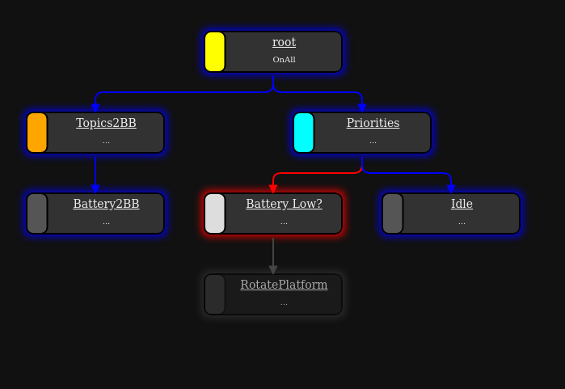

# SS23_Assignment_BehaviorTree

## Task:
In this assignment, we will be looking into the implementation of behavior tree to achieve preliminary robot safety features to handle situations such as battery dropping below a threshold value and avoiding possible collisions. This exercise will further help in your project on building an autonomous wall-following behavior.

## Overview:

The majority of implementations of behavior trees in robotics are using 'BehaviorTree.CPP' in cpp and 'py_trees' in python. 'py_trees_ros' is a wrapper for 'py_trees' to integrate py_trees with ROS. We will be using 'py_trees_ros' to implement behavior trees. 

Please clone the repository of the assignment("https://github.com/HBRS-AMR/SS23_Assignment_BehaviorTree.git") in the src/ folder of your workspace (It can be cloned inside the workspace having rolling packages as well).

Description of the files:

1. **behaviors.py**: all behaviors that can be used in behavior tree are defined can be described this script.

2. **battery_monitor.py**: is a behavior tree implementation to constantly check the battery status of the robot and to trigger rotation behavior once the battery level goes beyond a threshold value. Please find the sample visualisation for battery_monitor behavior tree below:


3. **collison_avoidance.py**: is a behavior tree implementation which adds a new feature of collision avoidance to the battery_monitor behavior tree. Please find the sample visualisation for collison_avoidance behavior tree below:


## Task:

To complete the scripts in **behaviors.py**, **battery_monitor.py** and **collison_avoidance.py** according to the instructions given in the scripts. The py_trees [documentation](https://py-trees.readthedocs.io/en/release-2.1.x/introduction.html) and py_trees_ros [tutorial](https://py-trees-ros-tutorials.readthedocs.io/en/release-2.1.x/tutorials.html) page are helpful to understand the implementation of behavior trees.

## Setting up your system:

1. In Ubuntu 20.04, behavior tree has support for ROS2 foxy version. So along with ROS2 rolling (which you have already installed, if not please follow the steps from the [first worksheet](https://github.com/HBRS-AMR/Robile/tree/rolling/worksheets/worksheet01)), please install ROS2 foxy version using the following set of commands from [here](https://docs.ros.org/en/foxy/Installation/Ubuntu-Install-Debians.html):

    ```
    sudo apt install software-properties-common

    sudo add-apt-repository universe

    sudo apt update && sudo apt install curl -y

    sudo curl -sSL https://raw.githubusercontent.com/ros/rosdistro/master/ros.key -o /usr/share/keyrings/ros-archive-keyring.gpg

    echo "deb [arch=$(dpkg --print-architecture) signed-by=/usr/share/keyrings/ros-archive-keyring.gpg] http://packages.ros.org/ros2/ubuntu $(. /etc/os-release && echo $UBUNTU_CODENAME) main" | sudo tee /etc/apt/sources.list.d/ros2.list > /dev/null
    
    sudo apt update

    sudo apt upgrade

    sudo apt install ros-foxy-desktop python3-argcomplete

    ```

2. If not completed already, please clone the assignment file ("https://github.com/HBRS-AMR/SS23_Assignment_BehaviorTree.git") in the src folder of your workspace (it can be cloned inside the workspace having rolling packages as well). Source the ROS2 foxy setup file. Whenever behavior tree related packages are to be run, please source this file followed by the workspace setup file:
    ```
    source /opt/ros/foxy/setup.bash
    ```

    From the workspace directory, build the workspace:
    ```
    colcon build --symlink-install
    ```

    Now source the workspace setup file:
    ```
    source install/local_setup.bash
    ```

3. From the `same terminal`, install the py_trees related packages: 

    ``` 
    ros-foxy-py-trees

    ros-foxy-py-trees-ros

    ros-foxy-py-trees-ros-interfaces

    ros-foxy-py-trees-ros-viewer

    sudo apt-get install xcb
    ```

## Instructions to run scripts:

1. Please install the teleop-twist-keyboard package to control the robot in the simulation.
    ```
    source /opt/ros/rolling/setup.bash
    sudo apt-get install ros-rolling-teleop-twist-keyboard
    ```

2. Keep at least two terminals reserved for running the behavior tree launch file and the visualisation tool (described further down in this section) and source the ROS2 foxy setup file and the corresponding workspace setup file:
    ```
    source /opt/ros/foxy/setup.bash
    source install/setup.bash
    ```

    In the rest of the terminals (to launch simulation, publish voltage commands, to use teleop etc.), source the ROS2 rolling setup file and the corresponding workspace setup file:
    ```
    source /opt/ros/rolling/setup.bash
    source install/setup.bash
    ```

3. Please test your implementation in simulation and then on the real robot. Please refer to the [first worksheet](https://github.com/HBRS-AMR/Robile/tree/rolling/worksheets/worksheet01) to run the Robile in simulation. Once the robot is running in simulation, in the terminals reserved for launching behavior trees, launch the behavior tree launch file. For example, to launch collison_avoidance behavior tree, please run the following command:
    ```
    ros2 launch autonomous_map_update collison_avoidance.launch.py
    ```

4. To control the robot in simulation, please run the following command:
    ```
    ros2 run teleop_twist_keyboard teleop_twist_keyboard
    ```

5. As the battery percentage is not readily available for ROS2 interface, please publish the battery percentage values in a new terminal. From the below example, instead of 50.0, please publish the battery percentage value of your choice:
    ```  
    ros2 topic  pub /battery_voltage std_msgs/msg/Float32  data:\ 50.0\ 
    ```


6. This point is relevant only when you are running on the real robot. If running in simulation, please skip to the next point. To run packages on the robot, please connect to the robot's wifi network (Robile_5G) and ssh to the robot (ip-address of robile3 is considered for the below example. Please replace with the ip-address of the robot you are using):
    ```
    ssh -x studentkelo@192.168.0.103
    ros2 launch robile_bringup robot.launch
    ```
    Once it is running, in a new terminal on your system, run the following commands (this is one time activity)
    ```
    sudo ufw disable
    sudo ufw allow in proto udp to 224.0.0.0/4
    sudo ufw allow in proto udp from 224.0.0.0/4
    ```

    Now, based on the id of the robile you are using, set the 'ROS_DOMAIN_ID' environment variable in every terminal. Eg: for robile3, set it to 3. Proceed to get the list of topics:
    
    ```
    export ROS_DOMAIN_ID=3
    ros2 topic list
    ```   

    If you get any error or if the entire list of topics is not printed, then run these commands and try again to get the list of topics:
    ```
    ros2 daemon stop
    ros2 daemon start
    ros2 topic list
    ```

    If you still face the error, please inform the TA.

    Please proceed to launch the behavior tree launch file in the same terminal. For example, to launch collison_avoidance behavior tree, please run the following command:
    ```
    ros2 launch autonomous_map_update collison_avoidance.launch.py
    ```

    Similarly, in another terminal please make sure 'ros2 topic list' is working by following the steps above and run rviz. Select the appropriate config file or select the necessary topics for visualisation in rviz:
    ```
    rviz2
    ```

7. To visualize the behavior tree and view the instantaneous status of behaviors, please run the following command (this should be run in the terminal where the setup file of foxy is sourced):
    ```
    py-trees-tree-viewer
    ```

8. To render a graph of the behavior tree as an image file, please run the following command (this should be run in the terminal where the setup file of foxy is sourced):
    ```
    py-trees-render -b autonomous_map_navigate.battery_monitor.create_root

    py-trees-render -b autonomous_map_navigate.collison_avoidance.create_root
    ```

9. The values in the 'blackboard' can be displayed by running the following command (this should be run in the terminal where the setup file of foxy is sourced):
    ```
    py-trees-blackboard-watcher
    ```

## References:

1. [Behavior Trees in Action:
A Study of Robotics Applications](https://arxiv.org/pdf/2010.06256.pdf)

2. Tutorial for behavior tree implementation (py_trees_ros): https://py-trees-ros-tutorials.readthedocs.io/en/release-2.1.x/tutorials.html

3. Tutorial for py_trees: https://py-trees.readthedocs.io/en/release-2.1.x/introduction.html
